# 🛒 Shopping Lists — Flujos frontend

> Flujos UX del módulo `modules/shopping`. Documento vivo: cada cambio de comportamiento debe reflejarse aquí.
> Ver `.context/guidelines/router/shopping-lists.md` para los endpoints del backend.

---

## Convenciones del documento

- **Actores**:
  - `User` → persona usando la app.
  - `UI` → componente React (screen / form / modal).
  - `Store` → `useShoppingStore` (Zustand).
  - `Storage` → `secureStorage` (guest persist / auth cache).
  - `Net` → `NetInfo` (detección de conectividad).
  - `API` → backend KASHY.
- **Modos**:
  - `Guest` → `!isAuthenticated`. Persistencia local.
  - `Auth online` → `isAuthenticated && online`. Sincronización vs API.
  - `Auth offline` → `isAuthenticated && !online`. Fallback local + retry queue.
- **Estados de lista**:
  - `Draft` → existe solo en `activeList`, no está en `state.lists`, no está persistida.
  - `Saved local` → en `state.lists`, ID `local-*`, persistida en `secureStorage` (`GUEST_LISTS_KEY`).
  - `Saved server` → en `state.lists`, ID UUID server, sincronizada vía PATCH coalesced.
- **Tipos** (enum `listType`):
  - `TEMPLATE` (label UI: **Borrador**) → pre-lista, lo que vas a comprar.
  - `RECEIPT` (label UI: **Activa**) → en el supermercado, registrando precios y marcando productos.
  - `COMPLETED` (label UI: **Completada**) → compra finalizada, read-only. ⚠️ **Requiere coordinación backend** (nuevo valor en enum).
- **Tabs de la pantalla `/shopping`**: 3 tabs → `Borradores` | `Activas` | `Completadas`.
- **Límites**:
  - `GUEST_MAX_LISTS = 2` → cap de listas locales en modo invitado.

---

## Plantilla de cada flujo

````markdown
### Flow: <nombre corto>

**Contexto:** <qué problema resuelve, cuándo se dispara>

**Precondiciones:**

- <estado requerido para iniciar>

**Pasos:**

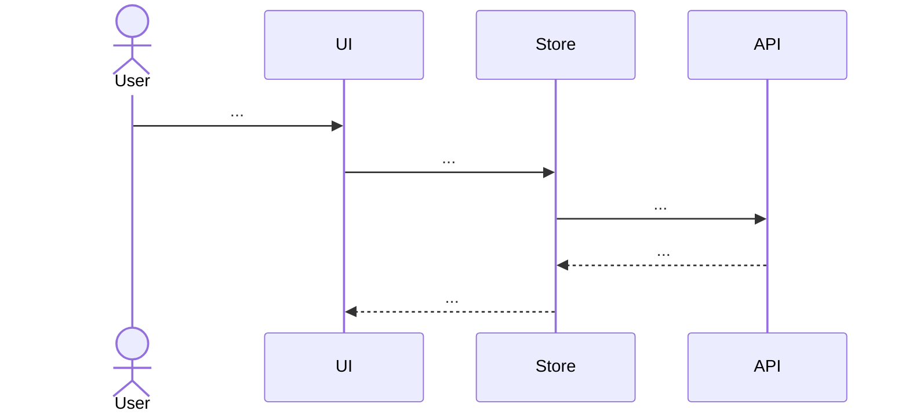

**Tabla de estados:**

| Paso | Actor | Acción | `activeList` | `lists` | `storage` |
| :--- | :---- | :----- | :----------- | :------ | :-------- |
| 1    | ...   | ...    | ...          | ...     | ...       |

**Errores y casos borde:**

| Caso | Comportamiento esperado |
| :--- | :---------------------- |
| ...  | ...                     |
````

---

## Índice de flujos

1. [Entrada al módulo](#flow-1--entrada-al-m%C3%B3dulo-shopping)
2. [Crear borrador — guest dentro del límite](#flow-2--crear-borrador--guest-dentro-del-l%C3%ADmite)
3. [Crear borrador — guest al límite (bloqueo)](#flow-3--crear-borrador--guest-al-l%C3%ADmite-bloqueo)
4. [Crear borrador — auth (online)](#flow-4--crear-borrador--auth-online)
5. [Crear borrador — auth offline (fallback local)](#flow-5--crear-borrador--auth-offline-fallback-local)
6. [Guardar borrador](#flow-6--guardar-borrador)
7. [Salir sin guardar (alert)](#flow-7--salir-sin-guardar-alert)
8. [Convertir borrador en compra activa](#flow-8--convertir-borrador-en-compra-activa-template--receipt)
9. [Editar compra activa (precios + IVA + currency toggle)](#flow-9--editar-compra-activa-precios--iva--toggle-usdbs)
10. [Marcar compra como completada](#flow-10--marcar-compra-como-completada-receipt--completed)
11. [Sync guest → auth post-login](#flow-11--sync-guest--auth-post-login)
12. [Reconexión auth offline → online](#flow-12--reconexi%C3%B3n-auth-offline--online)
13. [Comparar listas (multi-select en tab Recibos)](#flow-13--comparar-listas-multi-select-en-tab-recibos)
14. [Eliminar lista (swipe en listado)](#flow-14--eliminar-lista-swipe-en-listado)

---

## Flujos

### Flow 1 — Entrada al módulo `/shopping`

**Contexto:** usuario abre el tab `Compras`. UI determina origen de datos según modo (guest, auth-online, auth-offline) y muestra tabs por tipo.

**Precondiciones:**

- Ninguna (público).

**Pasos:**

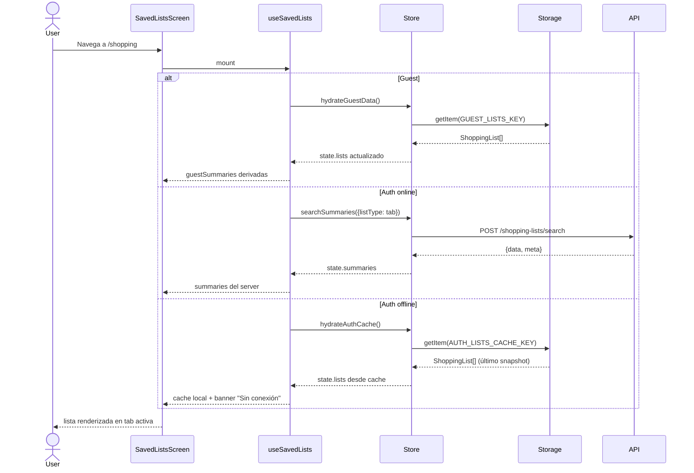

**Tabla de estados:**

| Paso | Actor | Acción                | Modo       | `lists` resultante      |
| :--- | :---- | :-------------------- | :--------- | :---------------------- |
| 1    | User  | abre `/shopping`      | cualquiera | sin cambios             |
| 2    | Hook  | dispara init effect   | cualquiera | sin cambios             |
| 3a   | Store | hydrateGuestData      | guest      | ← storage local         |
| 3b   | Store | POST search           | auth on    | sin cambios (summaries) |
| 3c   | Store | hydrateAuthCache      | auth off   | ← cache local           |
| 4    | UI    | filtra por tab activa | cualquiera | sin cambios             |

**Errores y casos borde:**

| Caso                             | Comportamiento esperado                                                         |
| :------------------------------- | :------------------------------------------------------------------------------ |
| Storage corrupto (JSON inválido) | Catch + `removeItem` + listas vacías. Log warning.                              |
| `POST search` 401                | Interceptor refresh token + retry. Si vuelve a fallar → logout + redirect.      |
| `POST search` red caída          | Mostrar cache (`AUTH_LISTS_CACHE_KEY`) + banner "Mostrando datos sin conexión". |
| Auth login fresco, sin cache     | Estado loading; al recibir respuesta render. Si error red → empty + retry.      |

---

### Flow 2 — Crear borrador — guest dentro del límite

**Contexto:** guest tiene `< GUEST_MAX_LISTS` listas locales y tap FAB `Nueva`.

**Precondiciones:**

- `!isAuthenticated`
- `state.lists.filter(l => l.id.startsWith('local-')).length < 2`

**Pasos:**

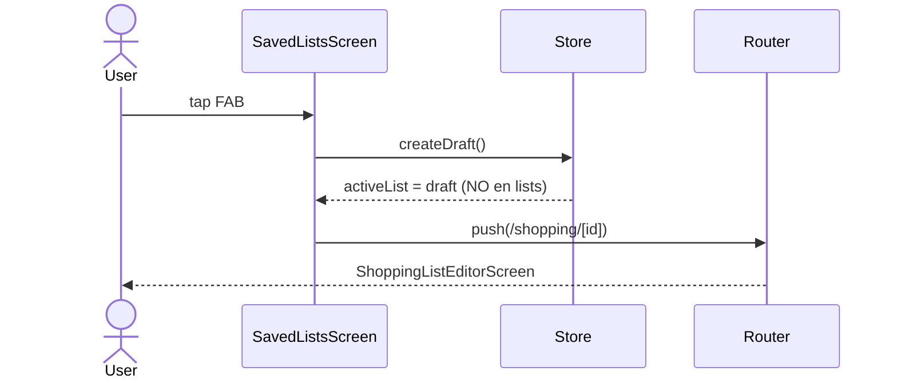

**Tabla de estados:**

| Paso | Actor | Acción      | `activeList`    | `lists`     | `storage`   |
| :--- | :---- | :---------- | :-------------- | :---------- | :---------- |
| 1    | User  | tap FAB     | null            | [`local-A`] | [`local-A`] |
| 2    | Store | createDraft | `draft local-B` | [`local-A`] | [`local-A`] |
| 3    | UI    | navigate    | `draft local-B` | [`local-A`] | [`local-A`] |

**Errores y casos borde:**

| Caso                                   | Comportamiento esperado                           |
| :------------------------------------- | :------------------------------------------------ |
| User vuelve sin guardar y sin items    | `discardActiveDraftIfEmpty` en unmount → cleanup. |
| User vuelve sin guardar pero CON items | AlertDialog "Lista sin guardar" (Flow 7).         |

---

### Flow 3 — Crear borrador — guest al límite (bloqueo)

**Contexto:** guest ya tiene `GUEST_MAX_LISTS` (2) listas locales y tap FAB.

**Precondiciones:**

- `!isAuthenticated`
- `state.lists.filter(l => l.id.startsWith('local-')).length >= 2`

**Pasos:**

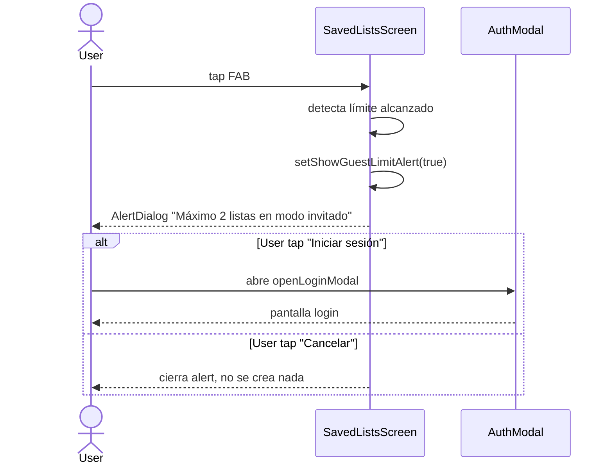

**Tabla de estados:**

| Paso | Actor | Acción               | `activeList` | `lists`     | `storage`   |
| :--- | :---- | :------------------- | :----------- | :---------- | :---------- |
| 1    | User  | tap FAB              | null         | 2 lists     | 2 lists     |
| 2    | UI    | abre AlertDialog     | null         | sin cambios | sin cambios |
| 3a   | User  | tap "Iniciar sesión" | null         | sin cambios | sin cambios |
| 3b   | User  | tap "Cancelar"       | null         | sin cambios | sin cambios |

**Errores y casos borde:**

| Caso                                | Comportamiento esperado                                                     |
| :---------------------------------- | :-------------------------------------------------------------------------- |
| User loguea desde el modal          | Trigger Flow 11 (sync guest→auth). Después puede crear ilimitadas.          |
| User cancela login y sigue en guest | Mantiene las 2 locales. FAB sigue bloqueado hasta eliminar una o loguearse. |

---

### Flow 4 — Crear borrador — auth (online)

**Contexto:** usuario logueado con red, tap FAB.

**Precondiciones:**

- `isAuthenticated && online`

**Pasos:**

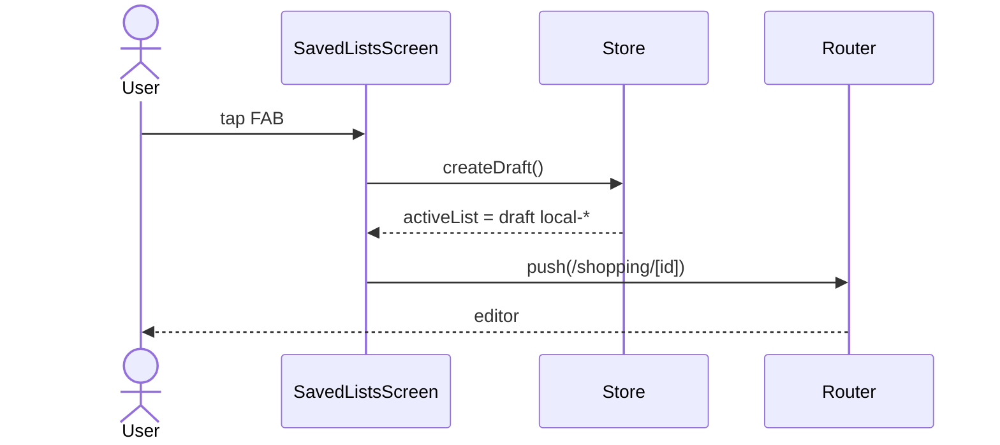

> El draft sigue siendo `local-*` hasta que se guarda con `commitDraft` (Flow 6) que hace POST al server y reemplaza el ID por UUID.

**Tabla de estados:** equivalente a Flow 2.

**Errores y casos borde:** sin diferencias relevantes hasta el commit (Flow 6).

---

### Flow 5 — Crear borrador — auth offline (fallback local)

**Contexto:** usuario logueado pierde red, intenta crear lista.

**Precondiciones:**

- `isAuthenticated && !online` (detectado por `NetInfo`).

**Pasos:**

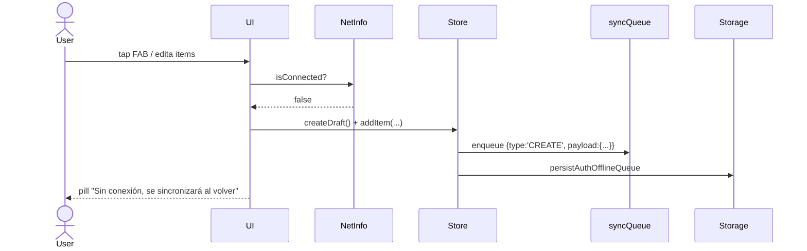

**Tabla de estados:**

| Paso | Actor   | Acción          | `activeList`    | `lists`      | `syncQueue`        |
| :--- | :------ | :-------------- | :-------------- | :----------- | :----------------- |
| 1    | User    | tap FAB offline | null            | server lists | []                 |
| 2    | Store   | createDraft     | `draft local-X` | server lists | []                 |
| 3    | User    | addItem         | draft con items | server lists | []                 |
| 4    | UI/Save | commitDraft     | `local-X saved` | + `local-X`  | + `CREATE local-X` |

**Errores y casos borde:**

| Caso                                | Comportamiento esperado                                                |
| :---------------------------------- | :--------------------------------------------------------------------- |
| Reconexión durante edición          | Flow 12 dispara flush automático.                                      |
| User cierra app antes de reconectar | Queue persistida en storage; al reabrir + reconectar se reanuda flush. |
| POST falla por validación (422)     | Mantener local + marcar item de queue con `error`. UI muestra detalle. |

---

### Flow 6 — Guardar borrador

**Contexto:** usuario en editor tap `Bookmark`. Abre modal `SaveListForm` para nombrar la lista y promoverla.

**Precondiciones:**

- `activeList` existe y es draft (no está en `lists`).

**Pasos:**

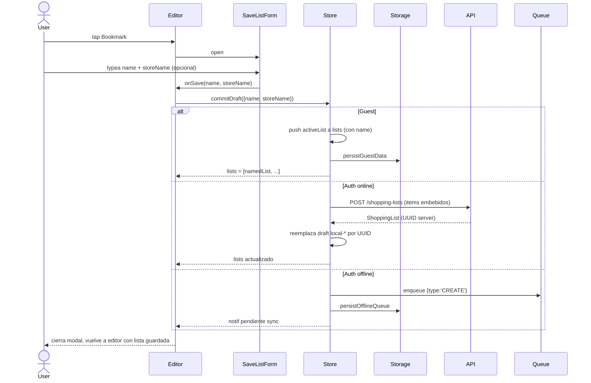

**Tabla de estados:**

| Paso | Modo     | `activeList`                    | `lists`     | `storage` / `queue`     |
| :--- | :------- | :------------------------------ | :---------- | :---------------------- |
| 1    | guest    | `draft local-X` (sin nombre)    | sin `X`     | sin `X`                 |
| 2    | guest    | `local-X` con nombre            | + `local-X` | + `local-X` en storage  |
| 1'   | auth on  | `draft local-X`                 | sin `X`     | -                       |
| 2'   | auth on  | `server-UUID` (reemplaza local) | + UUID      | -                       |
| 1''  | auth off | `draft local-X`                 | sin `X`     | queue vacía             |
| 2''  | auth off | `local-X` con nombre            | + `local-X` | queue: `CREATE local-X` |

**Errores y casos borde:**

| Caso                                        | Comportamiento esperado                                                                      |
| :------------------------------------------ | :------------------------------------------------------------------------------------------- |
| Nombre vacío                                | Botón Guardar disabled. Validación en `SaveListForm` (`!trimmedName`).                       |
| Auth POST 422 (exchangeRate fuera de rango) | Refrescar `/exchange-rate/current` + reintentar. Si vuelve a fallar, mostrar error en modal. |
| Auth POST 401                               | Interceptor refresca token + retry. Si falla, logout.                                        |

---

### Flow 7 — Salir sin guardar (alert)

**Contexto:** usuario en editor con un draft que tiene items, tap back.

**Precondiciones:**

- `activeList` es draft (no en `lists`).
- `activeList.items.length > 0`.

**Pasos:**

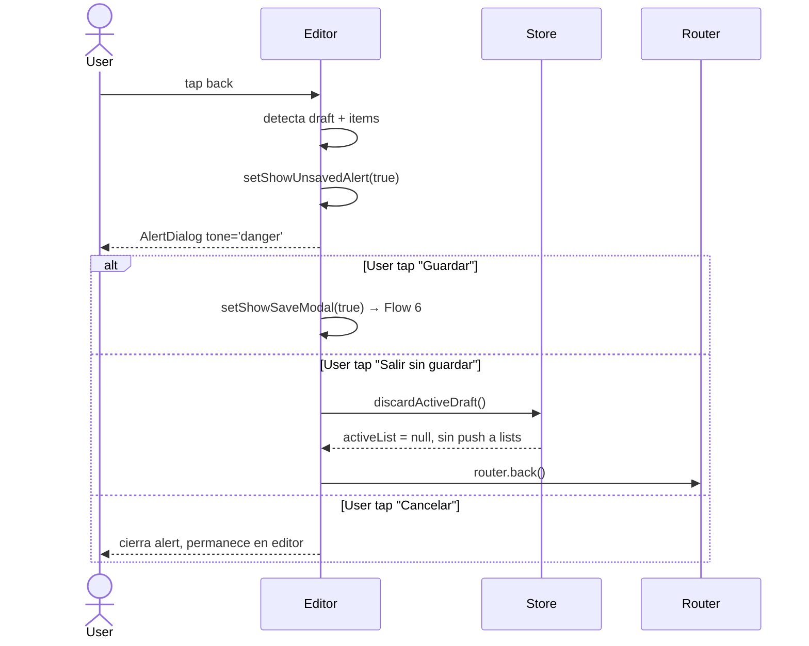

**Tabla de estados:**

| Paso | Acción User   | `activeList`    | `lists`     | `storage`   |
| :--- | :------------ | :-------------- | :---------- | :---------- |
| 1    | tap back      | draft con items | sin cambios | sin cambios |
| 2a   | Guardar       | draft con items | sin cambios | sin cambios |
| 2b   | Salir sin gd. | null            | sin cambios | sin cambios |
| 2c   | Cancelar      | draft con items | sin cambios | sin cambios |

**Errores y casos borde:**

| Caso                                     | Comportamiento esperado                                                                                                                                                                               |
| :--------------------------------------- | :---------------------------------------------------------------------------------------------------------------------------------------------------------------------------------------------------- |
| Draft vacío + nombre default             | Sin alert. Cleanup auto vía `discardActiveDraftIfEmpty` en unmount.                                                                                                                                   |
| Lista ya guardada (no draft)             | Sin alert. Back directo, mutaciones ya coalesced + persisted.                                                                                                                                         |
| Swipe gesture / hardware back en Android | useEffect cleanup hace `discardActiveDraftIfEmpty` (solo si vacío). Drafts con items persisten en memoria hasta nueva acción. **Mejora futura:** interceptar back gesture para mostrar alert también. |

---

### Flow 8 — Convertir borrador en compra activa (TEMPLATE → RECEIPT)

**Contexto:** usuario llega al supermercado, abre un borrador guardado y tap `ListChecks` para activar el modo "compra activa".

**Precondiciones:**

- `activeList.listType === 'TEMPLATE'`
- `activeList` está en `lists` (no draft).

**Pasos:**

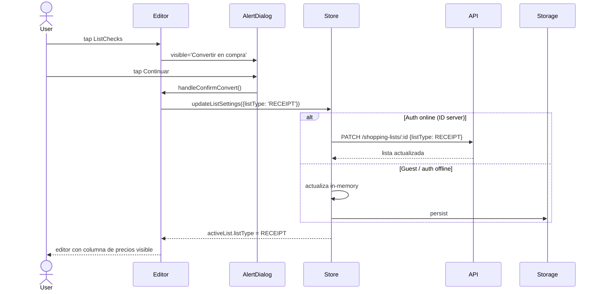

**Tabla de estados:**

| Paso | Actor | Acción             | `listType` antes | `listType` después |
| :--- | :---- | :----------------- | :--------------- | :----------------- |
| 1    | User  | tap ListChecks     | TEMPLATE         | TEMPLATE           |
| 2    | User  | confirma Continuar | TEMPLATE         | TEMPLATE           |
| 3    | Store | updateListSettings | TEMPLATE         | RECEIPT            |

**Errores y casos borde:**

| Caso                                                       | Comportamiento esperado                                                                                                  |
| :--------------------------------------------------------- | :----------------------------------------------------------------------------------------------------------------------- |
| User cancela el AlertDialog                                | listType permanece TEMPLATE. Sin cambios.                                                                                |
| PATCH 422 (`exchangeRateSnapshot` ya inmutable en RECEIPT) | No aplica: la transición es de TEMPLATE → RECEIPT, el snapshot se sigue validando ±1%. Si falla, refrescar rate + retry. |
| Lista ya es RECEIPT                                        | Botón no se renderiza (gate `isTemplate && !isDraft`).                                                                   |

---

### Flow 9 — Editar compra activa (precios + IVA + toggle USD/Bs)

**Contexto:** lista RECEIPT abierta. Usuario en el supermercado: marca productos a medida que los recoge, captura precios reales, toggle moneda de entrada.

**Precondiciones:**

- `activeList.listType === 'RECEIPT'`.
- Tasa de cambio disponible (`useExchangeRate`).

**Pasos:**

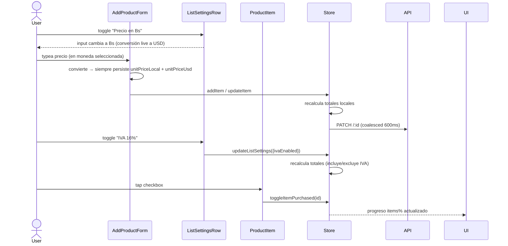

**Tabla de estados (mutaciones):**

| Acción                  | Effects en lista                                                | Persistencia                             |
| :---------------------- | :-------------------------------------------------------------- | :--------------------------------------- |
| addItem(input)          | items += {…}, recalc totales                                    | PATCH coalesced (auth) / storage (guest) |
| updateItem(id, data)    | items[i] mutated, recalc totales                                | idem                                     |
| toggleItemPurchased(id) | items[i].isPurchased flip                                       | idem                                     |
| updateItemQuantity      | items[i].quantity + recalc totales                              | idem                                     |
| toggleIva               | ivaEnabled flip + recalc                                        | idem                                     |
| togglePriceInLocal      | solo UI flag; valor numérico siempre se persiste como Local+USD | sin persistencia store                   |

**Conversión USD ↔ Bs:**

- `priceInLocal = true` → input acepta Bs. UI muestra Bs grande + USD pequeño.
- `priceInLocal = false` → input acepta USD. UI muestra USD grande + Bs pequeño.
- Conversión usa `exchangeRateSnapshot` (no la tasa live una vez snapshot freezado en RECEIPT).
- Ambos campos (`unitPriceLocal`, `unitPriceUsd`) se persisten siempre — el backend valida coherencia.

**IVA:**

- `ivaEnabled = true` → `ivaLocal = subtotalLocal * 0.16`, `totalLocal = subtotalLocal + ivaLocal`.
- `ivaEnabled = false` → `ivaLocal = 0`, `totalLocal = subtotalLocal`.
- Backend es authoritative en auth (recalcula en server). Guest recalcula local con `recalculateTotals`.

**Errores y casos borde:**

| Caso                                   | Comportamiento esperado                                       |
| :------------------------------------- | :------------------------------------------------------------ |
| Sin tasa de cambio disponible          | Input solo permite Bs (no conversión). USD = null en payload. |
| PATCH falla en auth                    | Mantener cambio local, mostrar ErrorBanner, reintentar.       |
| User offline mid-edición               | PATCH cae, mantener mutación local + encolar (Flow 5/12).     |
| Item marcado como purchased sin precio | Permitido. `unitPriceLocal = 0` válido.                       |

---

### Flow 10 — Marcar compra como completada (RECEIPT → COMPLETED)

**Contexto:** usuario terminó de comprar, todos los items marcados. Habilita botón para finalizar la compra y convertir a `Recibo` (read-only).

**Precondiciones:**

- `activeList.listType === 'RECEIPT'`
- `activeList.items.length > 0`
- `activeList.items.every(i => i.isPurchased)` (100% marcados)

**Pasos:**

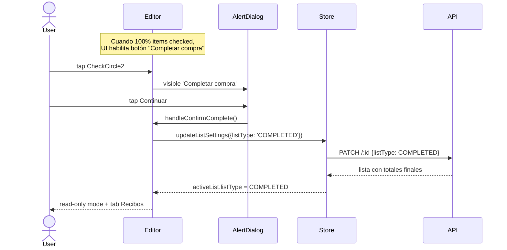

**Tabla de estados:**

| Paso    | listType  | items todos checked | Read-only | Tab destino |
| :------ | :-------- | :------------------ | :-------- | :---------- |
| antes   | RECEIPT   | true                | false     | Activas     |
| después | COMPLETED | true                | true      | Completadas |

**Errores y casos borde:**

| Caso                           | Comportamiento esperado                                                     |
| :----------------------------- | :-------------------------------------------------------------------------- |
| Items pendientes (no 100%)     | Botón disabled o no renderiza. Tooltip "Marca todos los productos primero". |
| User intenta editar COMPLETED  | Inputs disabled, ProductItem en read-only, header sin Bookmark/ListChecks.  |
| PATCH falla                    | Mantener RECEIPT, mostrar ErrorBanner, retry.                               |
| Auth offline                   | Aplica cambio local + encolar (Flow 12).                                    |
| Backend rechaza enum COMPLETED | ⚠️ Bloquea flujo hasta que backend agregue el valor al enum.                |

> ⚠️ **Requiere coordinación backend**: agregar `COMPLETED` al enum `listType` en spec + validación PATCH + posiblemente lógica para freezear `exchangeRateSnapshot` (similar a RECEIPT actual).

---

### Flow 11 — Sync guest → auth post-login

**Contexto:** guest se loguea (registro o login). Listas locales se promueven al server automáticamente sin intervención del usuario.

**Precondiciones:**

- Antes del login: `state.lists.filter(l => l.id.startsWith('local-')).length > 0`.
- Login exitoso → `isAuthenticated = true`.

**Pasos:**

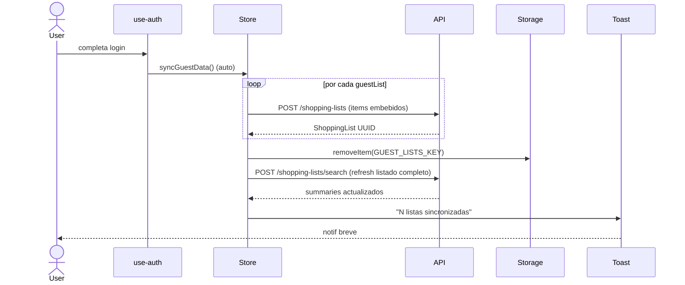

**Tabla de estados:**

| Paso | `lists` (local)        | `lists` (server)     | `storage`              |
| :--- | :--------------------- | :------------------- | :--------------------- |
| 1    | [`local-A`, `local-B`] | []                   | [`local-A`, `local-B`] |
| 2    | [`local-A`, `local-B`] | + `UUID-A`           | sin cambios            |
| 3    | [`local-A`, `local-B`] | + `UUID-A`, `UUID-B` | sin cambios            |
| 4    | []                     | [`UUID-A`, `UUID-B`] | guest key removida     |

**Errores y casos borde:**

| Caso                              | Comportamiento esperado                                                             |
| :-------------------------------- | :---------------------------------------------------------------------------------- |
| POST individual falla (red / 422) | Mantener esa lista en `lists` como `local-*`. Reintenta en próximo login / Flow 12. |
| Todos los POST fallan             | No borrar `GUEST_LISTS_KEY`. Mostrar toast warning "No se pudieron sincronizar".    |
| Guest sin listas locales          | No-op. No mostrar toast.                                                            |
| Lista guest con items vacíos      | Skip (no merece POST). Limpiar de storage al fin del sync.                          |

---

### Flow 12 — Reconexión auth offline → online

**Contexto:** usuario auth perdió red, hizo mutaciones que quedaron en queue. Vuelve la conexión.

**Precondiciones:**

- `isAuthenticated`
- `syncQueue.length > 0` o `lists` contiene `local-*` no sincronizados.
- `NetInfo` detecta reconexión.

**Pasos:**

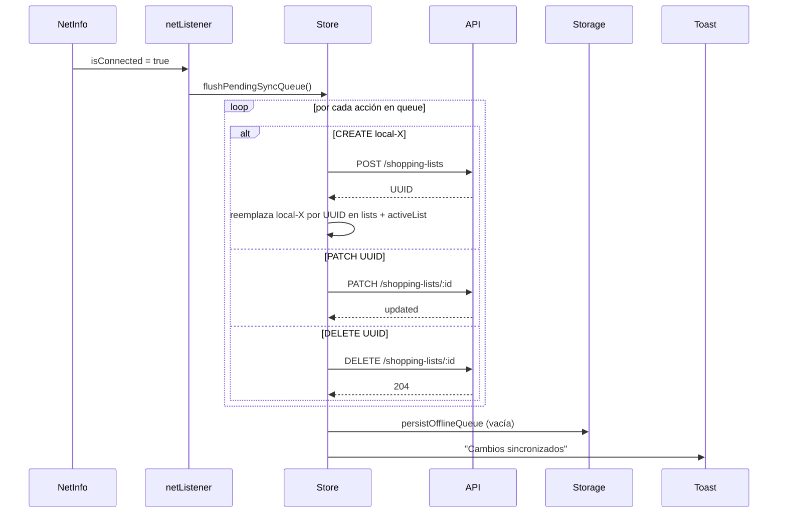

**Tabla de estados:**

| Paso | Net  | `syncQueue`                        | `lists`                  |
| :--- | :--- | :--------------------------------- | :----------------------- |
| 1    | down | [`CREATE local-X`, `PATCH UUID-Y`] | [`local-X`, `UUID-Y`]    |
| 2    | up   | (procesando)                       | sin cambios              |
| 3    | up   | [`PATCH UUID-Y`]                   | [`UUID-X-new`, `UUID-Y`] |
| 4    | up   | []                                 | sincronizadas            |

**Errores y casos borde:**

| Caso                                               | Comportamiento esperado                                                              |
| :------------------------------------------------- | :----------------------------------------------------------------------------------- |
| Reconexión efímera (vuelve a caer)                 | Cancelar requests en vuelo. Mantener queue. Esperar nueva reconexión estable.        |
| POST/PATCH falla por validación                    | Marcar item del queue con `error: message`. UI muestra alerta + opción "Reintentar". |
| Conflicto: server cambió la lista mientras offline | Server PATCH gana (last-write-wins). Refrescar lista local con respuesta server.     |
| Queue persistida en storage                        | Al abrir la app + reconectar, listener flushea automáticamente.                      |

> 🛠️ **Implementación pendiente**: `syncQueue` no existe aún en el store. Requiere:
>
> - Nuevo state `syncQueue: SyncAction[]`
> - Persist en `secureStorage` (`AUTH_OFFLINE_QUEUE_KEY`)
> - Hook con `NetInfo.addEventListener` que dispare `flushPendingSyncQueue`
> - Refactor de mutaciones (`addItem`, `updateItem`, etc.) para encolar en lugar de PATCH directo cuando `!online`

---

### Flow 13 — Comparar listas (multi-select en tab Recibos)

**Contexto:** usuario autenticado quiere comparar precios entre dos compras finalizadas en distintos supermercados. Disponible **solo en la tab `Recibos`** (`listType === 'COMPLETED'`). Long-press activa modo selección; al seleccionar exactamente 2 listas, CTA `Comparar` navega a `/shopping/compare` que dispara `POST /shopping-lists/compare`.

**Precondiciones:**

- `isAuthenticated && online`.
- Tab activa = `Recibos`.
- Al menos 2 listas `COMPLETED` en `state.lists`.

**Pasos:**

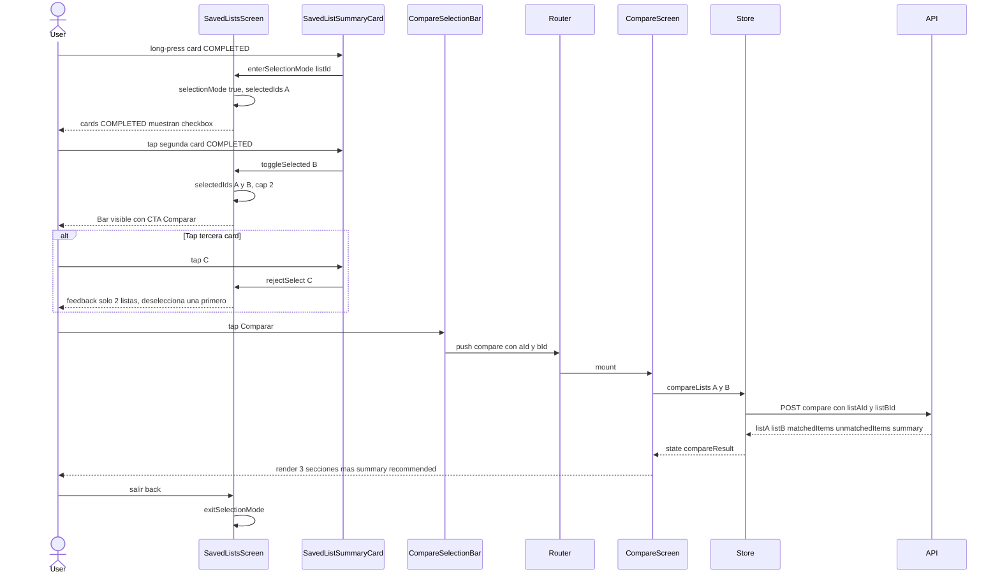

**Tabla de estados:**

| Paso | Actor   | Acción             | `selectionMode` | `selectedIds` | `compareResult` |
| :--- | :------ | :----------------- | :-------------- | :------------ | :-------------- |
| 1    | User    | long-press card A  | false → true    | [] → [A]      | null            |
| 2    | User    | tap card B         | true            | [A] → [A,B]   | null            |
| 3    | User    | tap card C (3ra)   | true            | [A,B] (no-op) | null            |
| 4    | User    | tap "Comparar"     | true            | [A,B]         | null            |
| 5    | Store   | POST /compare ok   | true            | [A,B]         | resultado       |
| 6    | Compare | render             | true            | [A,B]         | resultado       |
| 7    | User    | back desde compare | false           | []            | null            |

**Errores y casos borde:**

| Caso                                           | Comportamiento esperado                                                                       |
| :--------------------------------------------- | :-------------------------------------------------------------------------------------------- |
| Modo guest (`!isAuthenticated`)                | Long-press no entra en modo selección. Feature gated: CTA invisible o redirige a login modal. |
| Auth offline (`!online`)                       | Long-press habilitado pero CTA `Comparar` disabled con banner "Requiere conexión". Sin POST.  |
| Usuario long-press en card TEMPLATE / RECEIPT  | Ignorado. Solo cards COMPLETED activan selección. Otras tabs no muestran checkbox.            |
| User cambia de tab durante selección           | `exitSelectionMode()` automático. Tab navigation prevalece sobre selección.                   |
| Tap segunda vez en card ya seleccionada        | Deselecciona (`selectedIds.filter(id !== B)`). Si queda 0, sale del modo selección.           |
| 404 una de las listas (borrada concurrente)    | Mostrar mensaje "Una lista ya no existe", router.back(). Refrescar listado.                   |
| `POST /compare` 401                            | Interceptor refresh token + retry. Si vuelve a fallar → logout.                               |
| Red cae después de abrir CompareScreen         | Mostrar empty state con CTA "Reintentar". No cache local de comparaciones.                    |
| Hardware back / swipe back en SavedListsScreen | Sale del modo selección si activo; no navega afuera del tab hasta segundo back.               |

> ℹ️ La comparación **no persiste**: se calcula on-demand cada vez que se entra a `/shopping/compare`. Esto evita estados stale tras editar items de RECEIPT/COMPLETED.

---

### Flow 14 — Eliminar lista (swipe en listado)

**Contexto:** usuario quita una lista del listado. Swipe horizontal sobre la card revela botón `Eliminar`; tap dispara `AlertDialog` de confirmación. Disponible en **todos los tipos** (`TEMPLATE`, `RECEIPT`, `COMPLETED`) y **todos los modos** (guest, auth online, auth offline).

**Precondiciones:**

- Card visible en `SavedListsScreen` (cualquier tab).
- No estar en modo selección (Flow 13). Si modo selección activo → swipe deshabilitado.

**Pasos:**

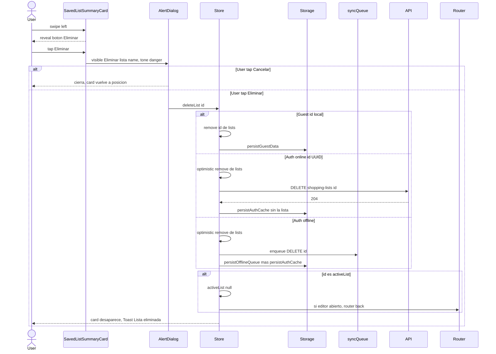

**Tabla de estados:**

| Paso | Modo       | Acción               | `lists` antes          | `lists` después | `activeList`  | `syncQueue`  | `storage`     |
| :--- | :--------- | :------------------- | :--------------------- | :-------------- | :------------ | :----------- | :------------ |
| 1    | cualquiera | swipe + tap Eliminar | [A, B]                 | [A, B]          | sin cambios   | sin cambios  | sin cambios   |
| 2    | guest      | confirm              | [`local-A`, `local-B`] | [`local-A`]     | null si era B | -            | actualizado   |
| 2'   | auth on    | confirm + DELETE 204 | [A, B]                 | [A]             | null si era B | -            | cache sin B   |
| 2''  | auth off   | confirm + encolar    | [A, B]                 | [A]             | null si era B | + `DELETE B` | cache + queue |

**Errores y casos borde:**

| Caso                                                            | Comportamiento esperado                                                                                                       |
| :-------------------------------------------------------------- | :---------------------------------------------------------------------------------------------------------------------------- |
| Lista eliminada era `activeList` con editor abierto             | Cerrar editor (`router.back()`), limpiar `activeList = null`, evitar pantalla huérfana.                                       |
| `DELETE` 404 (ya borrada en server)                             | Tratar como éxito. Remover de `lists` + cache. Log warning. Sin error al usuario.                                             |
| `DELETE` 401                                                    | Interceptor refresh + retry. Si vuelve a fallar → logout. Restaurar lista en `lists` (revertir optimistic).                   |
| `DELETE` 5xx                                                    | Restaurar lista en `lists`, Toast "No se pudo eliminar. Reintenta.". No encolar (es online).                                  |
| Auth offline: lista `local-*` no sincronizada aún               | Quitar de `lists` + cancelar la acción `CREATE local-*` correspondiente del `syncQueue`. No encolar `DELETE` (nunca existió). |
| Auth offline: lista UUID server, hay `PATCH` pendiente en queue | Eliminar el `PATCH` del queue + encolar `DELETE UUID`. El `PATCH` ya no aplica.                                               |
| User swipe en modo selección activo (Flow 13)                   | Gesture suprimido. Solo checkbox-toggle responde en ese modo.                                                                 |
| Concurrencia: usuario hace swipe-delete dos veces seguidas      | Segundo tap del Alert ignorado (`isDeleting` flag). Evita doble DELETE.                                                       |
| Pull-to-refresh durante delete pendiente                        | El refresh espera al settle del DELETE; usar el estado optimistic local.                                                      |

> ℹ️ Sin papelera/undo en MVP: el AlertDialog de confirmación es la única red de seguridad. Si en el futuro se quiere undo, sustituir AlertDialog por toast con `Deshacer` 5s antes del commit a API/storage.
